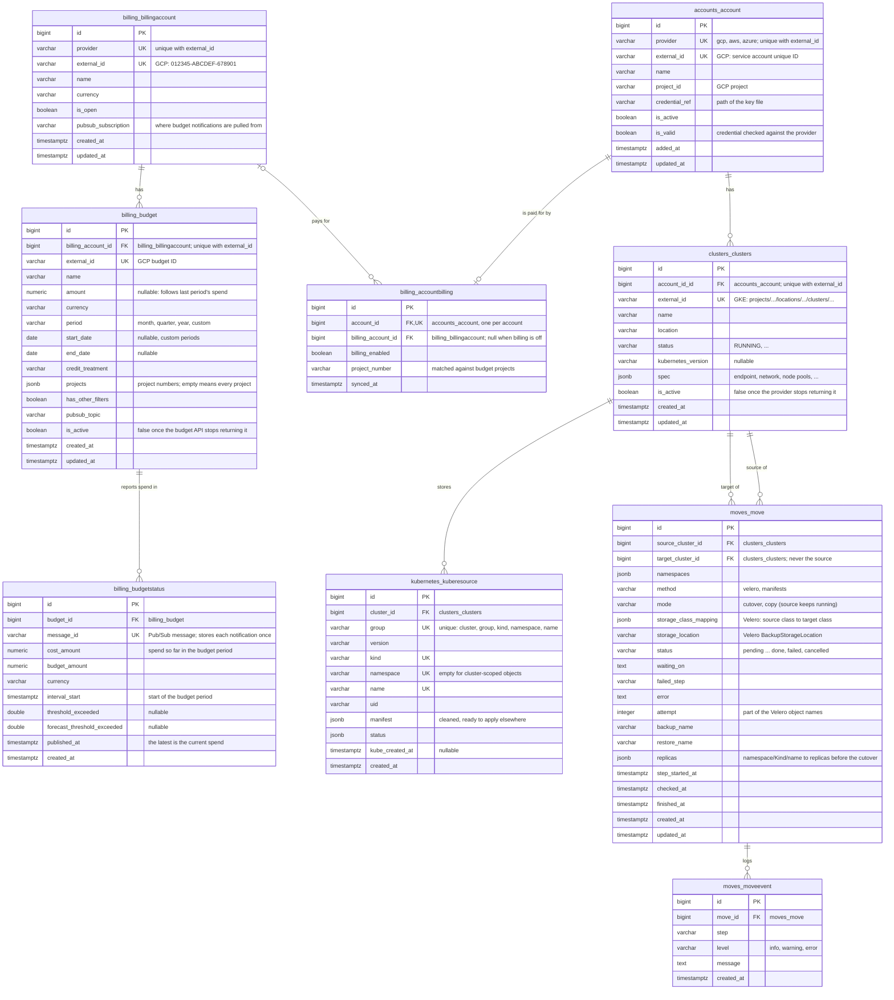

# Data model

CloudHop's tables in PostgreSQL, by app. Names are the real table and column names, so they can be used in SQL as they are. Django's own tables (auth, sessions, admin) are left out.

## Notes

- **Nothing is hard-deleted by a sync.** Clusters and budgets the provider no longer returns get `is_active = false`; resources are replaced as a whole on each resource sync of a cluster. Deleting an account deletes its clusters, their resources and moves (`ON DELETE CASCADE`).
- **Several accounts can share a billing account** (`billing_accountbilling.billing_account_id`), and with it its budgets and credits. A budget covers an account when its `projects` list is empty or holds the account's `project_number` (or project ID). That match is made in code, not by a foreign key.
- **Current spend** is the newest `billing_budgetstatus` row of a covering budget, by `published_at` (indexed on `budget_id, published_at DESC`). `cost_amount` is already the period's running total; rows are not summed.
- **`clusters_clusters.account_id_id`:** the foreign key field on the model is named `account_id`, so Django names its column `account_id_id`.
- **Indexes** besides primary keys, foreign keys and the unique constraints above: `kubernetes_kuberesource (cluster_id, kind)` and `(cluster_id, namespace)`.
- **`moves_move`** has a check constraint `source_cluster_id <> target_cluster_id`. Only one move per cluster runs at a time; that is checked in code.
